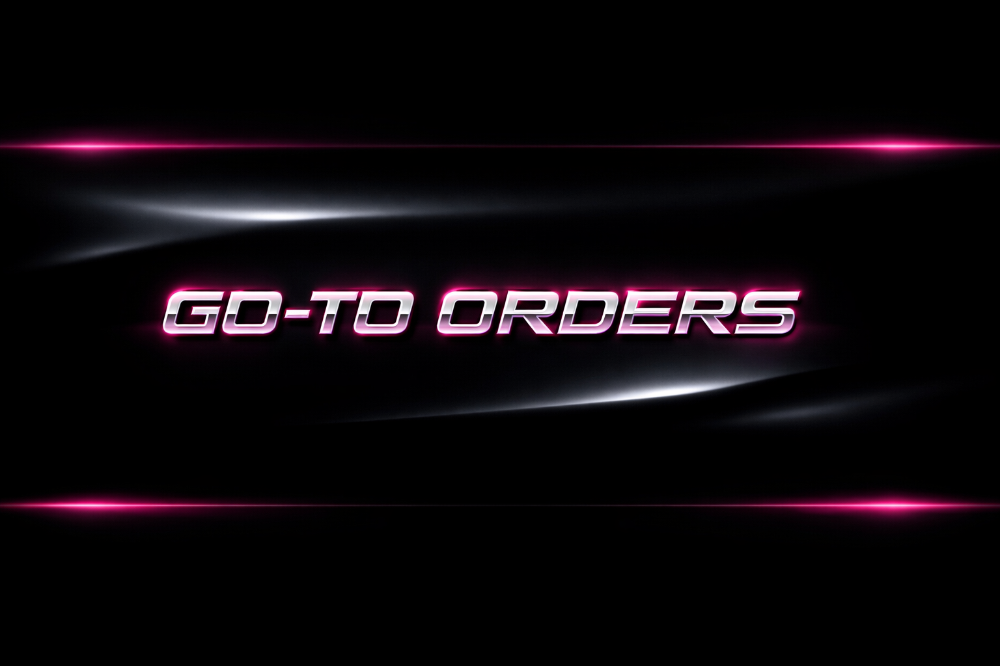

<p align="center">
  
</p>

# 💿 GO-TO ORDERS

✶ a minimal web app for saving favorite restaurants & go-to orders ✶  
✶ pink + black y2k porsche energy ✶  
✶ built for iphone safari ✶  

━━━━━━━━━━━━━━━━━━━━━━━  
✨ cute • fast • personal ✨  
━━━━━━━━━━━━━━━━━━━━━━━  

## 🖤 WHAT IT DOES

✦ save restaurants you love  
✦ remember exactly what to order  
✦ keep notes (mods, sauces, vibes)  
✦ no accounts, no ads, no noise  

everything stays on *your* device.

---

## 💗 TECH STACK

╭────────────────────╮  
│ React (CRA)        │  
│ CSS (custom theme) │  
│ LocalStorage       │  
│ GitHub Pages       │  
╰────────────────────╯  

---

## 📱 IOS FRIENDLY

✔ works in mobile safari  
✔ add to home screen  
✔ full-screen app feel  
✔ data persists locally  

designed mobile-first.

---

## 🎨 DESIGN DIRECTION

✶ pink + black palette  
✶ glossy dark UI  
✶ soft glow accents  
✶ rounded forms  
✶ early-2000s luxury web vibes  

think: *sports car dashboard, but cute.*

---

## 🚀 GETTING STARTED

### ⟡ clone the repo
```bash
git clone https://github.com/YOUR_USERNAME/go-to-orders.git
cd go-to-orders
